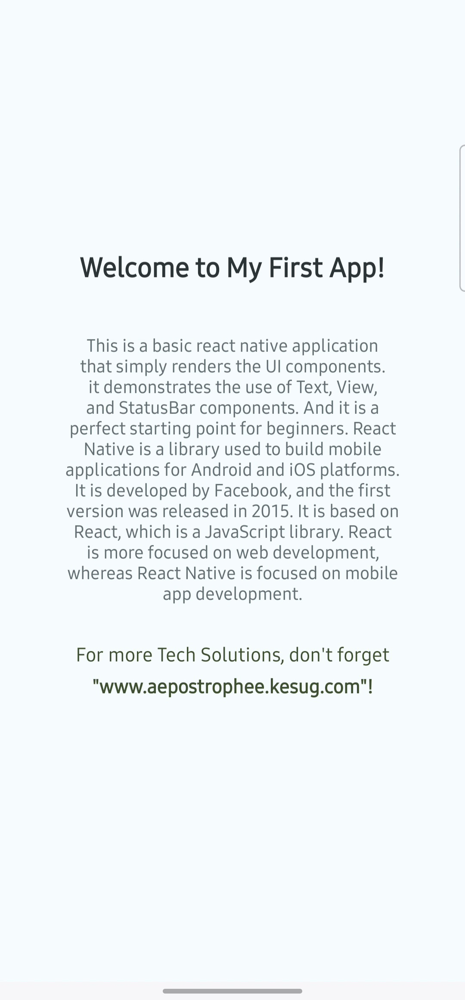

# Hello World Basic Mobile App



A simple "Hello World" mobile application built with React Native and Expo, demonstrating basic mobile app development setup.

## 🚀 Features

- Clean and modern UI
- Responsive layout
- Expo integration for easy development
- Cross-platform compatibility (iOS/Android)

## 🛠️ Technologies Used

- **React Native**: Cross-platform framework
- **Expo**: Development ecosystem
- **JavaScript**: Core programming language

## 📦 Installation

1. Clone the repository:
   ```bash
   git clone https://github.com/flickShot555/hello-world-app.git
   ```

2. install the dependencies:
   ```bash
   npm install
   ```

3. Start the development server:
   ```bash
   npm start
   ```

4. Open the Expo Go app on your mobile device and scan the QR code to run the app.  

## Project Structure

Basic-app/
├── .expo                 # Expo configuration files
├── assets                # Image assets
├── node_modules          # Dependency management
├── .gitignore            # Git configuration
├── App.js                # Main application component
├── app.json              # app configuration
├── index.js              # Main application entry point
├── package-lock.json     # Dependency management
├── package.json          # Dependency management
└── README.md             # Project documentation

## 🌟 Future Enhancements

- Add animation effects
- Implement theme switching
- Add navigation features
- Include user interaction elements


## 🤝 Contributing

- Contributions welcome! Follow standard GitHub workflow:
- Fork repository
- Create feature branch
- Commit changes
- Push to branch
- Open pull request


## 📧 Contact

author: Abbas Khan
Email: abbas1795khan@gmail.com
LinkedIn: https://linkedin.com/in/the-abbas-khan
GitHub: https://github.com/flickShot555/
Website: https://www.aepostrophee.kesug.com