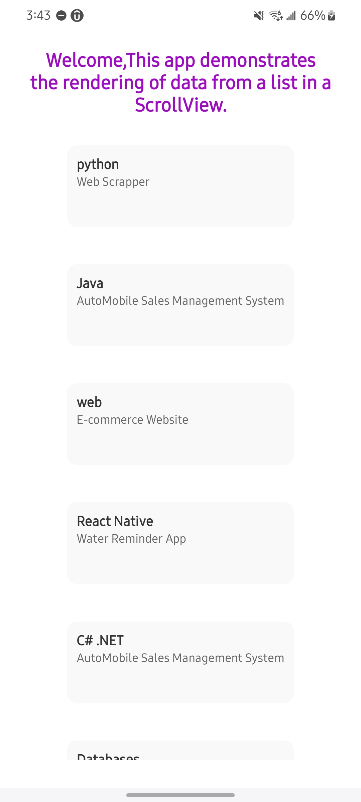

# Dynamic Data Rendering in React Native

App Preview [Add a screenshot of your app]


A React Native app that demonstrates how to dynamically render data from a list into a ScrollView. This project showcases essential skills for building scalable and performant mobile UIs.

## 🚀 Features
Dynamic Data Rendering: Renders a list of projects using Object.keys() and map().

ScrollView Integration: Smooth scrolling for large datasets.

Clean UI Design: Professional styling with consistent spacing and typography.

Real-World Examples: Displays projects across multiple technologies (Python, Java, React Native, etc.).

## 🛠️ Technologies Used

- **React Native**: Cross-platform framework
- **JavaScript**: Core programming language
- **ES6+**: Modern JavaScript syntax
- **Expo**: Development ecosystem
- **ScrollView**: Built-in React Native component for scrolling content
- **Object.keys()**: Method to get an array of a given object's own enumerable property names
- **map()**: Method to create a new array with the results of applying a provided function on
    every element in the calling array
    
## 📁 Project Structure

ListDisplayApp/

├── .expo                 # Expo configuration files

├── assets                # Image assets

├── node_modules          # Dependency management

├── .gitignore            # Git configuration

├── App.js                # Main application component

├── app.json              # app configuration

├── index.js              # Main application entry point

├── package-lock.json     # Dependency management

├── package.json          # Dependency management

└── README.md             # Project documentation


## 📦 Installation

1. Clone the repository:
    ```bash
    git clone
    ```

2. Install the dependencies:
    ```bash
    npm install
    ```

3. Start the development server:
    ```bash
    npm start
    ```

## 🌟 Code Highlights

Data Rendering Logic
```javascript
    const projects = {
    'Python': 'Web Scrapper',
    'Java': 'AutoMobile Sales Management System',
    'Web': 'E-commerce Website',
    'React Native': 'Water Reminder App',
    'C# .NET': 'AutoMobile Sales Management System',
    'Databases': 'Railways Management System'
    };
    <ScrollView>
    {Object.keys(myprojs).map((key, index) => (
        <View key={index} style={styles.itemContainer}>
        <Text style={styles.itemTitle}>{key}</Text>
        <Text style={styles.itemDescription}>{myprojs[key]}</Text>
        </View>
    ))}
    </ScrollView>
```

## 🌟 Future Enhancements

- Add **search functionality** to filter projects.
- Implement **pull-to-refresh** for dynamic data updates.
- Add **animations** for smoother transitions.
- Integrate with a **backend API** for real-time data fetching.


## 🤝 Contributing

Contributions, issues, and feature requests are welcome! Start by:
1. Forking the repository.

2. Create your feature branch:
    ```bash
    git checkout -b feature/AmazingFeature
    ```

3. Commit your changes:
    ```bash
    git commit -m 'Add some AmazingFeature'
    ```

4. Pushing to your branch.
    ```bash
    git push origin feature/AmazingFeature
    ```

5. Opening a pull request.


## 📧 Contact

**Author**: Abbas Khan

**Email**: [abbas1795khan@gmail.com](mailto:abbas1795khan@gmail.com)

**LinkedIn**: [The_Abbas_Khan](https://linkedin.com/in/the-abbas-khan)

**GitHub**: [flickShot555](https://github.com/flickShot555/)

**Portfolio**: [Aepostrophee](https://www.aepostrophee.kesug.com)